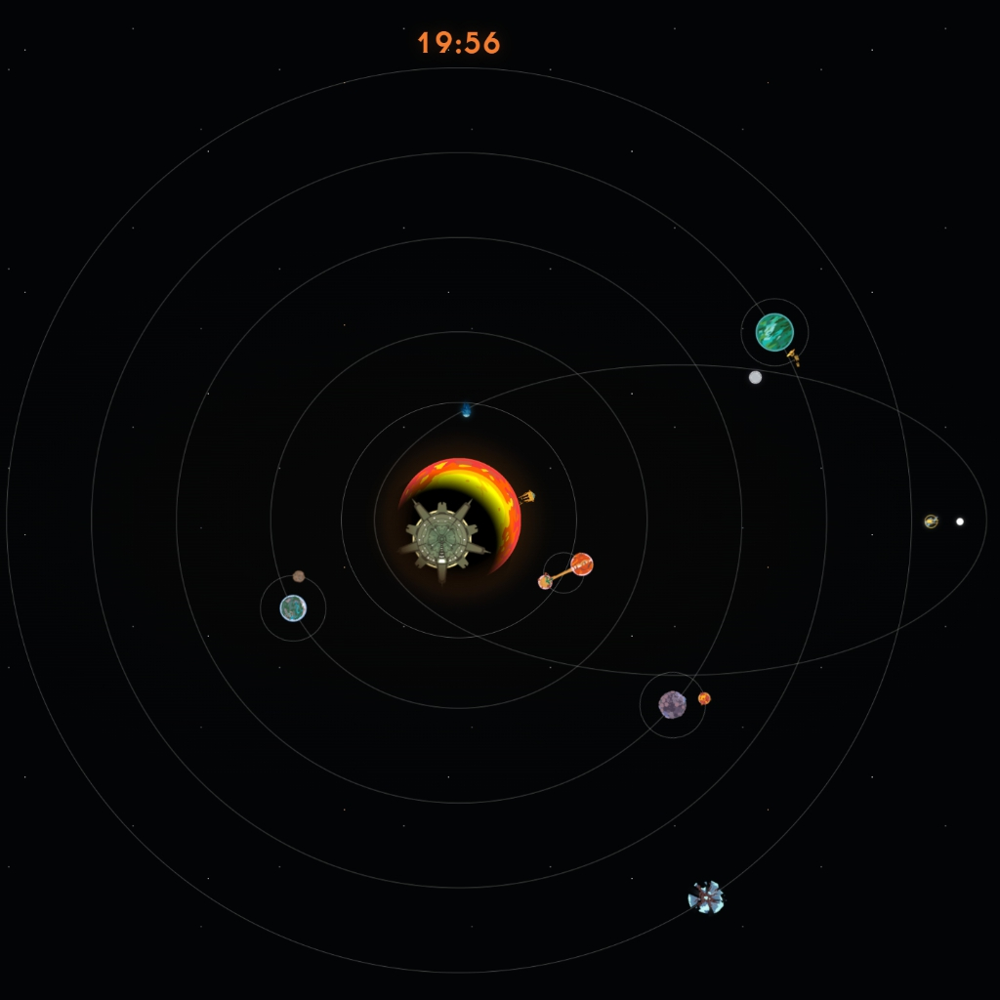

# Outer Wilds Solar System Wallpaper

An animated wallpaper inspired by the solar system of *Outer Wilds*, built with HTML, CSS, and JavaScript for Wallpaper Engine. It features orbiting celestial bodies, the Interloper, the Quantum Moon, The Stranger briefly eclipsing the Sun, and a clock showing the current time.

Wallpaper Engine properties let you customize orbit appearance, the size of the entire solar system, clock font size and position, overall movement speed, star density, and the background color. The project uses images from the `assets` folder and loads `index.html` as its main page.

